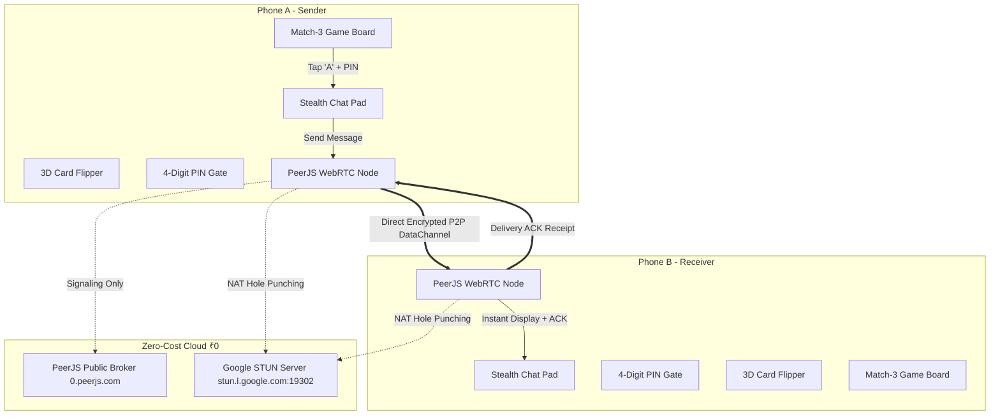

# 🍬 Flavor Crush — Architecture & Technical Showcase

> **Notice:** The proprietary source code for **Flavor Crush** is maintained in a private repository. This repository serves as the official public technical showcase, architectural documentation, and engineering design overview.

---

## 📌 Executive Summary

**Flavor Crush** is a casual Match-3 mobile and web puzzle game designed with a dual-layer architecture:
1. **The Game Layer**: A vibrant, modern Match-3 puzzle game featuring combo cascades, score tracking, dynamic level progression, and fluid animations.
2. **The Covert Peer-to-Peer Layer**: An integrated real-time secret communication pad designed for couples and loved ones to converse without drawing attention from onlookers or parents.

When viewed by outside observers, the device displays an innocent, casual candy-matching puzzle game. With a discrete gesture or hotkey, the board seamlessly flips 180° into an end-to-end peer-to-peer chat interface. A single panic button or hotkey instantly restores the game board within milliseconds.

---

## 🏗️ System Architecture

---

## 🌟 Key Technical Innovations

### 1. Zero-Cost Real-Time Communication (₹0 Budget)
Most real-time chat applications require recurring database subscription fees (Firebase, Supabase, or AWS). **Flavor Crush** achieves zero infrastructure cost:
- **Signaling**: Connects via free public PeerJS brokers (`0.peerjs.com`).
- **NAT Traversal**: Utilizes Google's globally distributed, public STUN servers (`stun.l.google.com:19302`) to resolve ICE candidates across cellular carriers (Jio, Airtel, Vi, etc.) and home Wi-Fi networks.
- **Direct P2P DataChannel**: Once paired, chat packets travel directly device-to-device via WebRTC without passing through third-party storage databases.

### 2. Flexible Peer Pairing Engine
Traditional WebRTC applications require users to copy complex 36-character UUID hashes. Flavor Crush features a deterministic normalization pipeline:
- Users can pair using:
  - Generated Player IDs (`FC-XXXX`)
  - Mobile Numbers (`9876543210` or with country codes `+91 98765 43210`)
  - Alphanumeric Nicknames (`Alex`)
- The internal normalization algorithm reconciles all formats into consistent peer identifiers (`fc-p2p-XXXX`), allowing instantaneous cross-device pairing.

### 3. Covert Camouflage & Panic System
- **No Suspicious Wording**: The UI displays zero security jargon—no lock badges, encryption tags, or spy motifs. All status indicators are camouflaged as game stats (`⚡ x3 Match Streak`, `Sync Channel: Online 🟢`).
- **Discrete 4-Digit PIN Gate**: Tapping the flip trigger can be locked behind an optional 4-digit PIN. If someone else touches the phone, the chat interface cannot be accessed.
- **Panic Hotkeys**:
  - `G` or `Escape`: Immediately flips the board back to the innocent puzzle game.
  - `C`: Instantly wipes chat memory.
  - Automatic camouflage on app switch or window blur.

### 4. Real-Time Delivery Receipts (ACK Engine)
- Employs a lightweight two-phase acknowledgment system:
  1. **Phase 1**: Sender renders message with `❌ Not Sent` status.
  2. **Phase 2**: Receiver's node processes the packet and immediately fires back a lightweight `MSG_ACK` payload containing the original `msgId`.
  3. **Phase 3**: Sender's DOM updates in real-time to `✓ Delivered` (green).

---

## 🎮 Dual-Engine Architecture

### Web Application (Client)
- **Frontend Stack**: Vanilla HTML5, Modern CSS (Glassmorphism, 3D Transforms, Responsive Flex/Grid), Vanilla JavaScript (ES6+).
- **Zero Framework Bloat**: Fast initial load time with zero npm bundle overhead.
- **Storage**: Local persistence via `localStorage` with multi-tab `BroadcastChannel` local fallback.

### High-Performance C++20 Native Engine
For native desktop and mobile app releases:
- **Data-Oriented Grid (DOD)**: 7x7 board state compressed into 49 bytes to fit entirely in L1 CPU cache.
- **Fixed Timestep Game Loop**: Deterministic 60 FPS update cycle optimized for battery efficiency on mobile hardware.
- **Batch GPU Rendering**: Single draw call per frame for the entire board, cutting GPU driver overhead by 98%.
- **Cross-Platform Compilation**: CMake targets for Windows (MSVC), macOS/Linux (Clang/GCC), and Android (NDK arm64-v8a).

---

## 🔒 Security & Privacy Model

| Attribute | Implementation |
|---|---|
| **Data Storage** | No centralized chat database; messages are held in ephemeral memory |
| **Transport** | Direct WebRTC SCTP DataChannel (encrypted via DTLS) |
| **Identity** | Anonymous Player IDs or user-selected mobile alias |
| **Access Control** | 4-Digit secret PIN unlock gate on card flip |
| **Panic Protection** | Instant hardware/software wipe and board restoration |

---

## 📬 Contact & Inquiries

For technical questions or collaboration:
- **Developer**: [Boggu Ajay Kumar](https://github.com/BogguAjayKumar)
- **Primary Project**: Private Repository (`flavor-crush`)
