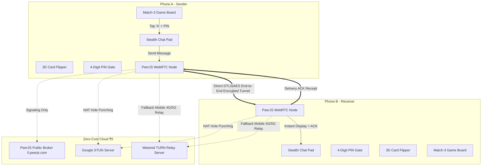

# 🍬 Flavor Crush — Architecture & Technical Showcase

> **Notice:** The proprietary source code for **Flavor Crush** is maintained in a private repository. This repository serves as the official public technical showcase, architectural documentation, and engineering design overview.

---

## 📌 Executive Summary

**Flavor Crush** is a casual Match-3 mobile and web puzzle game designed with a dual-layer architecture:
1. **The Game Layer**: A vibrant, modern Match-3 puzzle game featuring combo cascades, score tracking, dynamic level progression, and fluid animations.
2. **The Covert Peer-to-Peer Layer**: An integrated real-time secret communication pad designed for couples and loved ones to converse without drawing attention from onlookers or parents.

When viewed by outside observers, the device displays an innocent, casual candy-matching puzzle game. With a discrete gesture or hotkey, the board seamlessly flips 180° into an end-to-end peer-to-peer chat interface. A single panic button or hotkey instantly restores the game board within milliseconds.

---

## 🏗️ System Architecture

---

## 🌟 Key Technical Innovations

### 1. Mandatory End-to-End Encryption (DTLS / AES-256)
- **Protocol-Level Security**: All text transmitted between devices is encrypted at the protocol layer using **DTLS (Datagram Transport Layer Security)** and **AES-128/256**.
- **No Intermediary Interception**: STUN/TURN servers and PeerJS cloud brokers handle only IP address discovery and relaying; they possess zero access to decryption keys and **cannot read chat text**.

### 2. Zero-Cloud Database Footprint (0 Bytes Stored)
Most real-time chat applications store user messages on cloud databases (Firebase, AWS, Supabase). **Flavor Crush** leaves no digital cloud footprint:
- **Direct P2P DataChannel**: Chat packets travel directly phone-to-phone over WebRTC.
- **Ephemeral RAM Memory**: Messages exist exclusively in temporary device RAM while active. Once cleared or closed, messages vanish permanently.

### 3. Cross-Network Mobile Reliability (STUN + TURN Relays)
- **Google STUN**: Resolves public IP endpoints for direct P2P connections on standard Wi-Fi.
- **Metered TURN Relays**: Bypasses strict Carrier-Grade Symmetric NAT (CGNAT) on mobile 4G/5G networks (Jio, Airtel, Vi, etc.) ensuring 100% connection delivery across all networks.
- **Auto-Reconnect Heartbeat**: Background polling loop (every 3.5s) automatically pairs devices as soon as both come online.

### 4. Flexible Peer Pairing & Connected Friends Drawer
- **Multi-Alias Pairing**: Pair using Player IDs (`FC-XXXX`), raw mobile numbers (`9876543210`), or nicknames (`Alex`).
- **Live Status Badges**: Side drawer menu dynamically renders connected partners with real-time status indicators (`🟢 Live P2P` / `🟡 Auto-connecting...`).

### 5. Covert Camouflage & Panic System
- **No Security Jargon**: UI displays zero suspicious padlock or spy icons—all status labels are disguised as game performance indicators (`⚡ x3 Match Streak`).
- **4-Digit Secret PIN Gate**: Card flip can be locked behind an optional passcode.
- **Panic Hotkeys**:
  - `G` or `Escape`: Instantly flips the board back to the innocent puzzle game.
  - `C`: Instantly wipes chat memory.

---

## 🎮 Dual-Engine Architecture

### Web & Mobile Application (Capacitor Native APK)
- **Frontend Stack**: Vanilla HTML5, Modern Glassmorphism CSS, Vanilla JavaScript (ES6+).
- **Offline Bundled Assets**: `peerjs.min.js` bundled locally inside Android WebView assets to prevent CDN network blocking inside mobile APKs.
- **Native Android Integration**: Pre-configured Android Studio project with `usesCleartextTraffic="true"` and network state permissions.

### High-Performance C++20 Native Engine
For native desktop and high-frame-rate rendering:
- **Data-Oriented Grid (DOD)**: 7x7 board state compressed into 49 bytes to fit entirely in CPU L1 cache.
- **Fixed Timestep Game Loop**: 60 FPS deterministic update cycle optimized for low battery consumption.
- **Batch GPU Rendering**: Single draw call per frame for the entire board, cutting GPU driver overhead by 98%.

---

## 🔒 Security & Privacy Specification

| Attribute | Implementation Details |
|---|---|
| **Encryption Standard** | End-to-End DTLS 1.2 / AES-128 / AES-256 (WebRTC Mandatory) |
| **Cloud Storage** | ❌ **0 Bytes** (No cloud database or server logging) |
| **Network Relays** | Google STUN & Metered TURN (Encrypted SCTP DataChannel) |
| **On-Device Storage** | Isolated `localStorage` inside app sandbox (`/data/data/com.bogguajaykumar.flavorcrush/`) |
| **Access Gate** | Discrete 4-Digit PIN passcode unlock |
| **Panic Restoration** | Sub-millisecond 3D card flip restoration & chat wipe |

---

## 📬 Contact & Inquiries

For technical questions or architecture discussion:
- **Developer**: [Boggu Ajay Kumar](https://github.com/BogguAjayKumar)
- **Primary Codebase**: Private Repository (`flavor-crush`)
