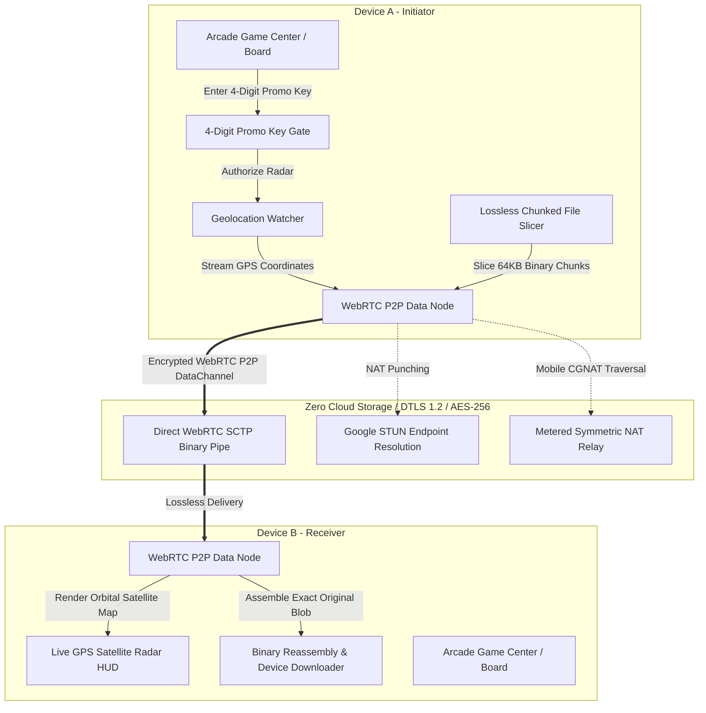

# 🍬 Flavor Crush — Architecture & Technical Showcase

[](#-proprietary-intellectual-property--anti-theft-declaration)
[](https://github.com/BogguAjayKumar)
[](https://webrtc.org/)
[](#-lossless-p2p-media-streaming-engine-10mb--500mb)
[](#-disguised-promo-key-live-location-radar)
[](#-anti-ai-training--data-mining-prohibition-notice)

> **CONFIDENTIAL ARCHITECTURAL SHOWCASE**  
> **Sole Author & Copyright Holder:** Boggu Ajay Kumar ([@BogguAjayKumar](https://github.com/BogguAjayKumar))  
> **Notice:** The production codebase for **Flavor Crush** is securely maintained in an authenticated private repository. This repository serves as the official public technical showcase, engineering architecture specification, and intellectual property record.

---

## 📌 Executive Summary

**Flavor Crush** is a dual-layer casual gaming and covert communication platform engineered with zero cloud database reliance. It bridges casual gaming ergonomics with an enterprise-grade peer-to-peer (P2P) steganographic communication engine:

1. **The Game Arcade Layer**:
   * **3-in-1 Solo Arcade**: Cascading Match-3 puzzle engine (54 progressive levels), 100% mathematically solvable Hamiltonian Flow Free puzzle with AI hint assistant, and a 60fps canvas Fruit Slice blade action engine.
   * **4-Game 2-Player Multiplayer Arena**: Turn-based live P2P duels over encrypted WebRTC data channels featuring 9x9 Multi-Grid Tic Tac Toe, 3D Hopping Snake and Ladder, 2-Player Ludo with star safeties, and 10x10 Fog-of-War Battleship naval warfare (with local deterministic AI rival fallbacks).
2. **The Covert Peer-to-Peer Layer**:
   * Disguised behind the arcade games is an end-to-end encrypted covert communication suite that allows partners to converse, stream high-fidelity media, and share real-time GPS locations without drawing attention from onlookers.
   * A discrete card-flip gesture rotates the screen 180° into a private pad protected by a camouflaged 4-digit promo key. Incorrect entries silently dismiss as an `"Expired Game Voucher"`.

---

## 🏗️ System Architecture & Workflow



---

## 🌟 Core Technical Innovations

### 1. 📦 Lossless P2P Media Streaming Engine (10MB – 500MB+)
* **Bit-for-Bit Fidelity**: Unlike conventional messaging apps that downscale and transcode photos and videos into blurry formats, Flavor Crush transfers files up to **500MB+** at full original quality. A 500MB 4K video or RAW photo arrives on the recipient's phone bit-for-bit identical.
* **HTML5 Chunked Slicing**: Files are read dynamically in 64KB `ArrayBuffer` binary chunks via `File.slice()`.
* **Backpressure Flow Control**: Monitors the WebRTC SCTP buffer (`dataChannel.bufferedAmount`). If queued data exceeds 2MB, transmission pauses to prevent memory overflow or dropped packets.
* **Live Transfer HUD**: Real-time progress updates displaying streaming speed (MB/s), percentage complete, elapsed time, and remaining bytes.
* **Direct Device Download**: Upon reassembly into a native `Blob`, the receiver can download the untouched original file directly into their device's storage with a single tap.

### 2. 🧭 Disguised Promo-Key Live Location & Satellite Radar HUD
* **Camouflaged Interface**: On the main arcade screen, an innocent button labeled **"🎁 Enter Promo Code"** sits alongside standard game counters.
* **Silent Rejection Protocol**: Entering an incorrect code simply shows `"⚠️ Promo Code Expired"` and closes cleanly, leaving no clue of any hidden functionality.
* **Encrypted Satellite Radar**: Entering the owner's configured 4-digit code unlocks the stealth live location radar:
  * **Real Satellite Imagery**: Integrated high-resolution **Google Hybrid Satellite** and **Esri World Imagery** layers showing aerial photography, roads, and landmark labels with zero blocking.
  * **Haversine Distance Tracking**: Continuously computes real-time distance (in meters and kilometers) and estimated driving/walking time between partners.
  * **P2P Geolocation Streaming**: Uses `navigator.geolocation.watchPosition` over direct WebRTC without passing through any tracking servers.
  * **Navigation Shortcut**: One-tap shortcut to launch turn-by-turn navigation in external mapping apps.

### 3. ⚔️ Real-Time 2-Player Multiplayer Arena
* **Synchronized P2P State Machine**: Four full multiplayer games operating on deterministic state exchange:
  * **Tic Tac Toe 9x9**: 81-cell territory capture system.
  * **Snake and Ladder**: 3D parabolic piece-hopping animations, slithers, and ladder climbs.
  * **Ludo 2-Player**: Full token yard release, capture resets, and safe star tiles.
  * **Battleship**: Naval radar grid with 3-shot salvo modes and fog-of-war tracking.
* **Deterministic AI Rival Fallback**: Offline mode with rule-based heuristics allows full solo play when no human partner is paired.

### 4. 🔒 Zero-Cloud Security & Protocol Specifications

| Security Vector | Implementation Detail |
|---|---|
| **Transport Layer** | WebRTC SCTP over DTLS 1.2 / SRTP / AES-256 |
| **Cloud Database Footprint** | **0 Bytes** (No chat logs, photos, or GPS coordinates stored on any server) |
| **Media Pipeline** | 64KB binary chunk streaming with SCTP flow control |
| **Location Privacy** | Direct peer-to-peer transmission; coordinates exist only in volatile RAM |
| **Emergency Panic** | Instant 1-tap board flip wiping active chat memory and restoring game cover |
| **Mobile Deployment** | Capacitor 8 native Android wrapper with pre-configured location and storage permissions |

---

## 🛡️ PROPRIETARY INTELLECTUAL PROPERTY & ANTI-THEFT DECLARATION

```
================================================================================
         LEGAL NOTICE: PROPRIETARY & CONFIDENTIAL INTELLECTUAL PROPERTY
================================================================================
Copyright (c) 2026 Boggu Ajay Kumar (https://github.com/BogguAjayKumar).
All Rights Reserved.
================================================================================
```

### 1. Ownership & Anti-Plagiarism Notice
This repository, its architectural designs, algorithmic workflows, visual elements, UI/UX implementations, and code snippets represent **proprietary intellectual property** exclusively authored and owned by **Boggu Ajay Kumar**.

* **No Cloning or Re-hosting**: You are strictly prohibited from copying, forking, scraping, mirroring, or redistributing this architecture or any derivative representation without prior written consent from the copyright holder.
* **No Commercialization or Reselling**: You may not repackage, white-label, license, or submit this project or any of its mechanics to the Google Play Store, Apple App Store, or any commercial software marketplace.
* **Protection of Trade Secrets**: The specific integration of WebRTC binary chunking, steganographic card flipping, and disguised promo-key authentication constitute protected trade secrets.

---

## 🚫 ANTI-AI TRAINING & DATA MINING PROHIBITION NOTICE

```
================================================================================
                MACHINE-READABLE ANTI-AI SCRAPING DIRECTIVE
                     TAGS: noai, noimageai, ai-train=no
================================================================================
```

**EXPRESS RESERVATION OF RIGHTS UNDER INTERNATIONAL LAW:**
1. Under **Article 4(3) of the European Union Directive on Copyright in the Digital Single Market (Directive (EU) 2019/790)**, the Indian Copyright Act 1957, the WIPO Copyright Treaty, and international copyright conventions, the author **expressly reserves all rights regarding text and data mining, automated crawling, and machine learning extraction**.
2. **Prohibited Activities**: No artificial intelligence model, large language model (LLM), neural network, automated code generator, or machine learning training crawler may ingest, scrape, tokenize, memorize, or process any text, diagrams, code, or architecture contained in this repository.
3. **Legal Consequences**: Any model found to have ingested this repository for generative output, distillation, or code reproduction will be subject to formal statutory infringement claims, DMCA takedown actions, and legal damages.

---

## ⚖️ COPYRIGHT DECLARATION

```
================================================================================
Copyright (c) 2026 Boggu Ajay Kumar.
All Rights Reserved.

THE SOFTWARE AND ARCHITECTURAL SPECIFICATIONS ARE PROVIDED UNDER STRICT
PROPRIETARY RESTRICTIONS. UNAUTHORIZED COPYING, DUPLICATION, PLAGIARISM,
RE-HOSTING, OR AI TRAINING CONSTITUTES A DIRECT VIOLATION OF INTERNATIONAL
COPYRIGHT LAW AND WILL BE SUBJECT TO IMMEDIATE LEGAL ACTION.
================================================================================
```

* **Lead Architect & Creator**: [Boggu Ajay Kumar](https://github.com/BogguAjayKumar)
* **Official Showcase Repository**: [BogguAjayKumar/flavor-crush-showcase](https://github.com/BogguAjayKumar/flavor-crush-showcase)
* **Private Production Repository**: [BogguAjayKumar/flavor-crush](https://github.com/BogguAjayKumar/flavor-crush)
